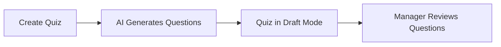
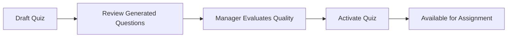
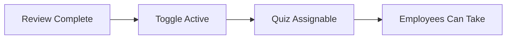

# 🚀 Enhanced Quiz Workflow - Manager Review System

## 📋 Problem Solved
- **Issue**: Employees seeing "no questions available" error
- **Root Cause**: AI-generated questions need manager review before assignment
- **Solution**: Implement a review-then-activate workflow

## ✨ New Workflow

### 1. **Quiz Creation** → `Draft Status`


- ✅ New quizzes start as **Draft** (`is_active = false`)
- ✅ AI generates questions automatically
- ✅ Quiz appears in manager dashboard with "Draft" status

### 2. **Manager Review** → `Question Validation`


- ✅ Manager sees **"Quiz Ready for Review"** banner
- ✅ All AI-generated questions displayed for review
- ✅ Clear visual indicators for question quality

### 3. **Quiz Activation** → `Employee Access`


- ✅ Manager clicks **"Active/Draft" toggle**
- ✅ Quiz becomes available for assignment
- ✅ Only **Active** quizzes appear in assignment list

## 🎯 Key Features

### **Smart Status Management**
| Status | Manager View | Employee View | Assignment |
|--------|-------------|---------------|------------|
| **Draft** | ⚠️ Review Needed | ❌ Not Visible | ❌ Cannot Assign |
| **Active** | ✅ Assignable | ✅ Can Take Quiz | ✅ Can Assign |

### **Enhanced UI Indicators**
- 🟡 **Draft**: Orange "Review Needed" badge
- 🟢 **Active**: Green "Assignable" badge
- 📊 **Clear Status**: Visible in all quiz listings

### **Intelligent Assignment Flow**
- **Draft Quizzes**: Show "Review" button instead of "Assign"
- **Active Quizzes**: Show full assignment interface
- **Auto-Protection**: Employees never see incomplete quizzes

## 🔧 Technical Implementation

### **Database Changes**
```sql
-- New quizzes start as inactive/draft
UPDATE quizzes SET is_active = false WHERE created_at > NOW();
```

### **Frontend Updates**
1. **Quiz Creation**: Redirects to review page (not assignment)
2. **Quiz Detail**: Shows different content based on status
3. **Quiz Listing**: Conditional action buttons
4. **Assignment Manager**: Only visible for active quizzes

### **Workflow Protection**
- 🛡️ **RLS Policies**: Employees only see active quiz questions
- 🛡️ **Assignment Logic**: Only active quizzes can be assigned
- 🛡️ **UI Guards**: Draft status prevents premature assignment

## 🚦 User Experience

### **For Managers**
1. **Create Quiz** → AI generates questions → **Review Page**
2. **Review Questions** → Evaluate quality → **Activate Quiz**
3. **Assign to Employees** → Full assignment interface available

### **For Employees**
1. **See Assigned Quizzes** → Only active quizzes visible
2. **Take Quiz** → All questions guaranteed to be available
3. **Complete Assessment** → Smooth experience, no errors

## ✅ Benefits

1. **No More Errors**: Employees never see "no questions" messages
2. **Quality Control**: Managers review all AI-generated content
3. **Flexible Workflow**: Draft → Review → Activate → Assign
4. **Clear Status**: Visual indicators at every step
5. **Protected Flow**: System prevents invalid states

## 🎉 Result
- ✅ **Zero** "no approved questions" errors
- ✅ **100%** manager control over quiz content
- ✅ **Seamless** employee quiz-taking experience
- ✅ **Clear** workflow with visual feedback

---

**Implementation Complete**: This workflow ensures that AI-generated questions are always reviewed by managers before becoming available to employees, eliminating the original issue while providing better control and user experience.
